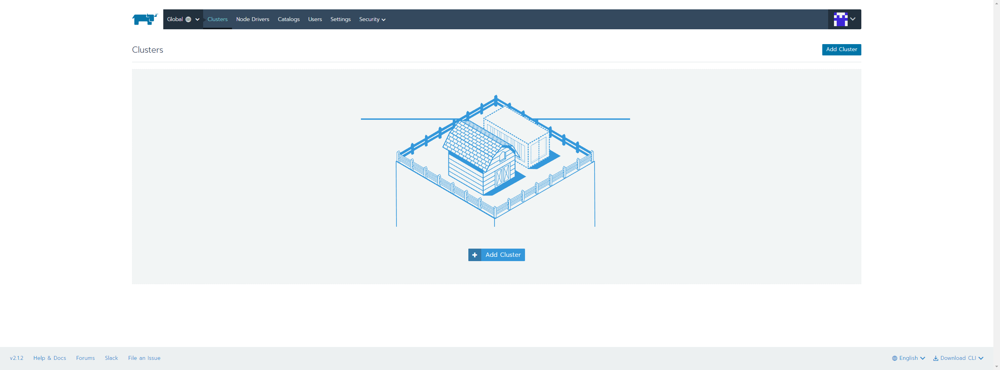
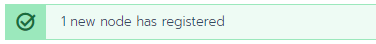
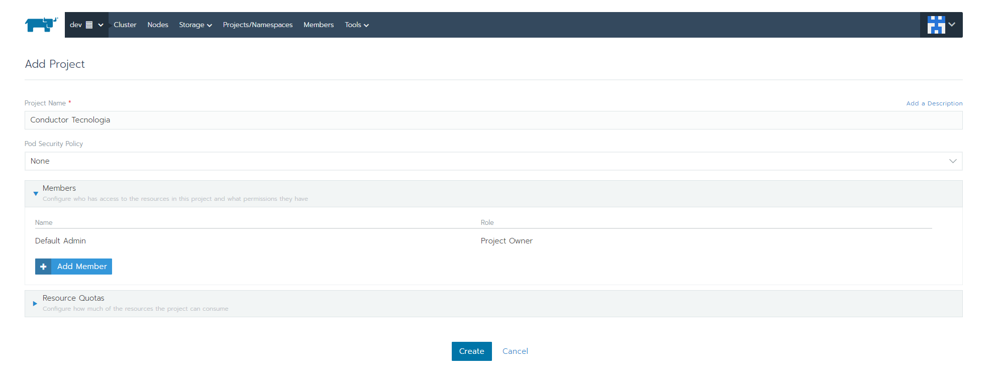
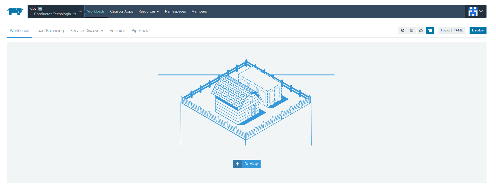

<div align="center">
  
</div>

# O que é Rancher?
Rancher é um orquestrador de containers que usa como base Kubernetes criado pela <a href="https://rancher.com/">Rancher Labs</a>.

# Instalação
Nesta documentação iremos abordar apenas a instalação do Rancher usando Single-Node, ou seja, iremos fazer um node em containers dentro do nosso servidor 
porém, saiba que o Rancher tem suporte para vários tipos de clouds, sendo elas Azure, Amazon, Google Cloud, entre outros...
<br />
Sem mais enrolação, vamos subir o Rancher com o seguinte comando:
```console
conductorlabs@pc:~$ docker run -d --restart=unless-stopped -p 8080:80 -p 9090:443 rancher/rancher:latest
```
Perceba que externalizamos duas portas, são elas a 8080 e 9090, não usamos 80 nem 443 do servidor pois essas portas estarão ocupadas com outros serviços do Rancher.

<br />
Com isso, seu Rancher já estará ativo, agora, entre no IP do seu servidor no browser seguido da porta 9090. Quando você entrar, terá uma tela de "boas-vindas", pedindo para você definir uma senha para o usuário "admin", após definir a senha, você terá que confirmar o IP do servidor do Rancher, aconselhamos que deixe o IP que já estiver preenchido, caso queira personalizar esse IP, fique à vontade.
<br /><br />
Depois de instalado, teremos a seguinte tela:
<br />

<br />

Vamos então adicionar nosso primeiro cluster, clique no botão Add Cluster, quando você clicar, abrirá uma tela de registro de Cluster, já que iremos trabalhar com o modelo single-node, clique em Custom, mais embaixo dê um nome ao Cluster, no nosso caso, iremos dar o nome de "dev", após isso, clique em Next. Após isso você irá para outra etapa, onde você poderá customizar o comando de execução desse node, procure pelas opções do node e marque as caixas "etcd" e "Control Plane". Na parte de baixo você verá que terá um comando de execução de um container, copie esse comando e execute no seu servidor.
```console
conductorlabs@pc:~$ sudo docker run -d --privileged --restart=unless-stopped --net=host -v /etc/kubernetes:/etc/kubernetes -v /var/run:/var/run rancher/rancher-agent:v2.1.2 --server https://<SEU-IP>:9090 --token <TOKEN-GERADO> --ca-checksum <CHECKSUM> --etcd --controlplane --worker
```
Após a execução deste comando, você vai ver que na interface do Rancher aparecerá uma mensagem como essa:

<br />
Vá na aba "Clusters" do menu do Rancher e aguarde até que o seu cluster esteja com o status "Active". Assim que ele estiver ativo, clique nele, você entrará num painel com alguns gráficos referentes ao consumo de CPU, Memória e Pods usados, nesta tela você já está com seu cluster devidamente configurado e com seu node funcionando.

# Criando uma aplicação
Para criar uma aplicação é muito simples, primeiro, crie um projeto acessando Projects/Namespaces no menu do Rancher. Assim que você clicar nesta opção, terá um botão "Add Project", clique nele. Na tela de cadastro de projeto, coloque o nome do seu projeto, e caso queira, personalize-o com configurações adicionais. Quando tudo estiver pronto, clique no botão Create, no nosso caso, colocamos apenas o nome e registramos o projeto como na imagem abaixo:

<br />
Verifique que agora temos nosso projeto, para acessá-lo, basta colocar o mouse por cima da primeira opção do menu do Rancher e clicar no projeto, o que irá lhe levar para uma tela parecida com essa:

<br />
Para fazer o deploy de uma aplicação agora é simples, clique no botão "Deploy". Você será redirecionado à página de deploy. No campo "Name", coloque o nome da sua aplicação (que também será o nome base do(s) pod(s)), no campo "Docker Image" coloque o nome da imagem que será rodada nesse deploy e no campo "Namespace", selecione ou crie um Namespace onde este deploy ficará dentro, os Namespace's servem mais como organizadores de aplicações, para que você possa separar em categorias ou algo do gênero, caso sua aplicação precise externalizar alguma porta, adicione a porta logo abaixo, caso queira adicionar environments, também terá logo abaixo uma aba onde você poderá setar os environments de sua aplicação, entre outras opções que você poderá configurar antes de fazer o deploy. Quando tudo estiver pronto, clique em "Launch". <b>Pronto! Você já tem sua primeira aplicação rodando perfeitamente :smile:</b>

