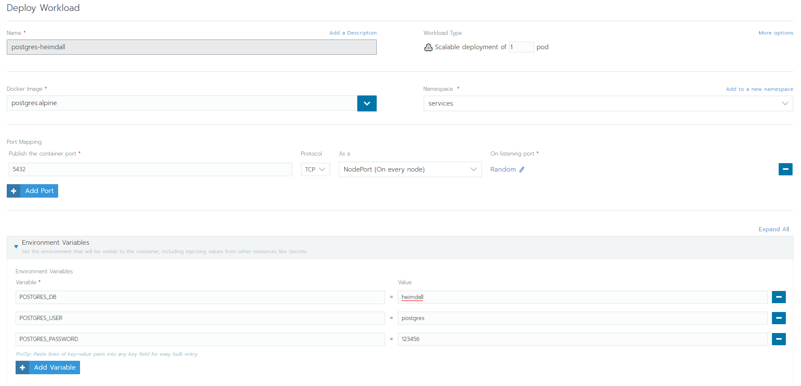
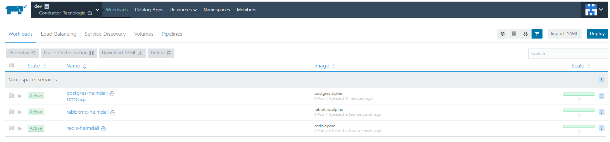
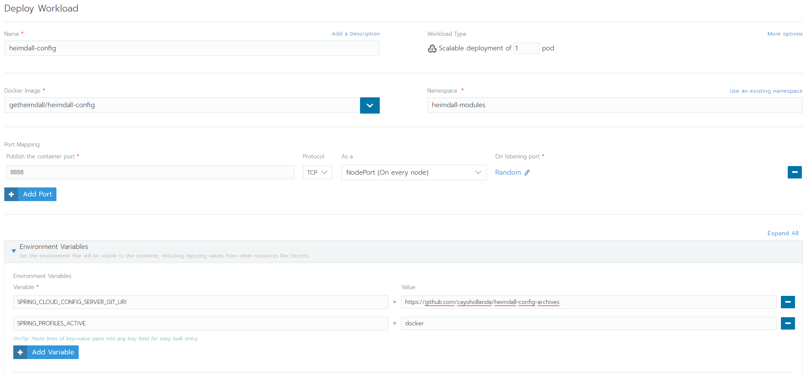
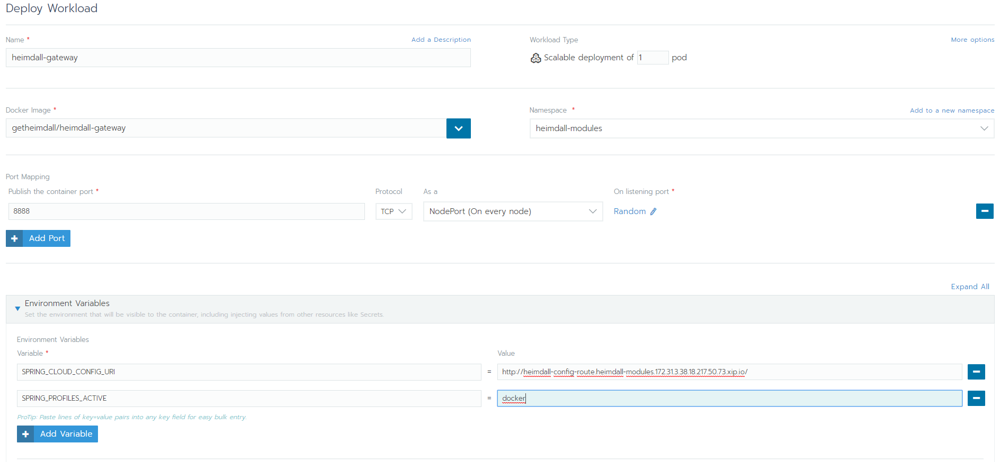
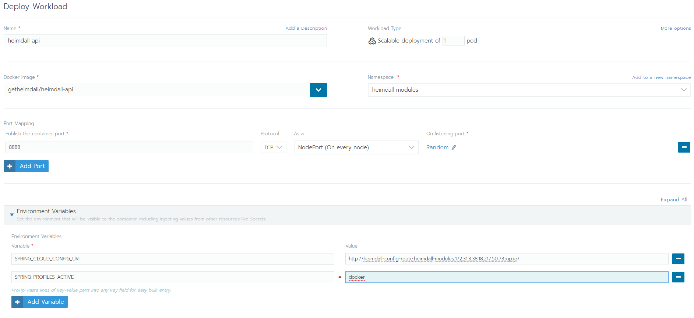
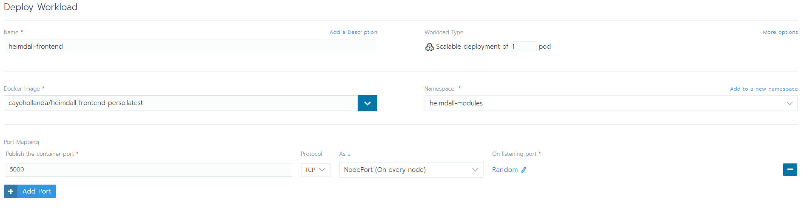
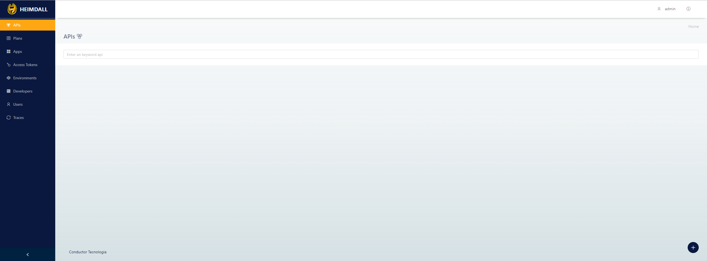

<div align="center">
  <a href="https://github.com/getheimdall/heimdall"></a>
  <a href="http://www.conductor.com.br/"></a>
</div>
<br />

# Subindo o <a href="https://getheimdall.io">getheimdall.io</a> no <a href="https://rancher.com">Rancher 2.0</a>
O <a href="https://getheimdall.io">getheimdall.io</a> é um orquestrador de API's que tem como objetivo trazer um caminho mais simples de manipular as requisições e respostas de sistemas empresariais

# Como funciona o Heimdall?
O Heimdall se divide em 4 partes que são essenciais para o funcionamento do orquestrador, são elas:
* Config  
O módulo de configurações do Heimdall é onde são centralizadas todas as configurações sejam ela de banco de dados, redis, rabbitmq e outros
* Gateway  
O Gateway é responsável por parte do mapeamento de rotas do sistema
* API  
A API é o módulo onde são recebidos, tratados e enviados os dados tanto para o front-end, quando para o banco de dados
* Front-end  
O Front-end é o módulo que o usuário terá acesso após tudo ser instalado corretamente

De acordo com a ordem, todos os módulos devem ser iniciados para que tenhamos o orquestrador em si, e é isso que faremos para inseri-lo no Rancher 2.0

# Pré-configurações
Primeiramente, certifique-se que já se encontra com o Rancher rodando no seu servidor, já com um Cluster + Node cadastrados e com um Project registrado 
para podermos cadastrar nossas Namespace's no mesmo. Caso não esteja, clique <a href="https://github.com/conductorlabs/wrapper/tree/master/rancher">aqui</a> para 
seguir nosso tutorial de como subir e configurar o Rancher para subirmos aplicações nele.

# Subindo os serviços (PostgreSQL, RabbitMQ, Redis)
Antes de subirmos os módulos do Heimdall, vamos subir antes os serviços nos quais os módulos funcionam por cima, buscando dados e gerenciando rotas<br />
Primeiro vamos subir o PostgreSQL, para fazermos isso, vamos nos nossos Workloads do projeto e clicar em Deploy. O nome da nossa aplicação será <code>postgres-heimdall</code> 
a imagem dele será <code>postgres:alpine</code>, e caso não exista, vamos criar uma Namespace chamada <code>services</code> para deixá-lo dentro dela. Após isso, externalize 
a porta <code>5432</code> do nosso serviço e vamos adicionar as seguintes environments (você pode alterá-las, mas terá de se lembrar de alterar quando for alterar o arquivo do heimdall-config): 
<br />
```console
POSTGRES_DB = heimdall
POSTGRES_PASSWORD = 123456
POSTGRES_USER = postgres
```
A página ficará algo parecido com isso: 
<div align="center">
  
</div>
<br />
Após isso, basta clicar em Launch e aguardar subir nosso PostgreSQL.
<br /><br />
Com o PostgreSQL ativo, vamos agora subir o redis. Para subir o redis começaremos da mesma forma do PostgreSQL, clicando em Deploy para adicionarmos um 
novo deploy, desta vez, o nome da aplicação será <code>redis-heimdall</code> e nossa imagem será <code>redis:alpine</code>, com isso configurado, basta clicarmos em Launch, 
não precisaremos definir nenhuma porta para externalizar nem nenhum environment para o redis.
<br /><br />
Após subir o redis, por fim, vamos subir o RabbitMQ, o processo será o mesmo, entramos para fazer um novo deploy, o nome será <code>rabbitmq-heimdall</code>, e a 
imagem será <code>rabbitmq:alpine</code>, por fim, clicamos em Launch.
<br /><br />
Ao fim de todos os deploys, teremos um total de 3 aplicações rodando, deverá estar algo parecido com isso: 
<br />
<div align="center">
  
</div>
<br />

# Subindo os módulos (Config, Gateway, API e Front-end)
Depois de termos subido todos os serviços que usaremos no nosso Heimdall, agora precisamos subir os módulos.
<br />
O primeiro módulo que subiremos será o do config, mas antes de tudo, você precisará criar um repositório Git onde ficarão as configurações 
do seu Heimdall, para isso, <a href="https://github.com/getheimdall/heimdall">entre no repositório do heimdall</a>, entre no diretório heimdall-config/src/main/resources/shared, 
veja que terão vários arquivos no formato <code>.yml</code>, seu repositório deverá ter todos eles exatamente com o nome que estão.
<br /><br />
Feito o repositório já com os arquivos, precisamos atualizá-los com os nossos serviços, para isso, entre no arquivo <code>application-docker.yml</code>, 
deixe-o aberto pois precisaremos dele. Agora volte no Rancher, entre dentro de cada um dos serviços (postgres-heimdall, redis-heimdall e rabbitmq-heimdall) 
e copie o IP Address de todos eles. Vamos agora substituir colocando esses IP's lá no nosso config, o do postgres-heimdall colocaremos em <code>heimdall.datasource.serverName</code>, 
o do redis colocaremos em <code>heimdall.redis.host</code> e o do RabbitMQ colocaremos em <code>spring.rabbitmq.host</code>
<br /><br />
Após atualizados os dados, vamos agora subir o nosso módulo de <b>configuração</b>. É bem parecido como fizemos para subir os serviços, vamos fazer um novo Deploy, o nome do nosso deploy será <code>heimdall-config</code>, a imagem dele será <code>getheimdall/heimdall-config</code>, e no Namespace, por organização, criaremos um novo Namespace chamado <code>heimdall-modules</code>, e é lá que ele ficará. Vamos externalizar a porta onde o config se encontrará rodando, geralmente a <code>8080</code>, no meu caso deixei por padrão a <code>8888</code>, e agora precisaremos definir dois environments para nosso config, que são eles: o caminho onde estão as configurações (ou seja, o link do repositório Git) e o perfil do Spring que será usado para subir o config (que será o perfil docker). No geral, nossas environments serão: 
<br />
```console
SPRING_CLOUD_CONFIG_SERVER_GIT_URI=<URL-DO-REPOSITORIO-GIT>
SPRING_PROFILES_ACTIVE=docker
```
<br />
No final, a tela do deploy ficará mais ou menos assim: 
<br />
<div align="center">
   
</div>
<br />
Após isso, basta clicar em Launch.
<br /><br />
Já temos o nosso config rodando, vamos agora gerar uma rota para ele no Ingress, para isso, basta ir na página de Load Balancing, chegando lá, clique em Add Ingress, o nome será <code>heimdall-config-route</code>, deixe marcado o primeiro option, e selecione o Workload do <code>heimdall-config</code> na porta que você definiu para ser externalizada quando foi realizar o deploy, que no meu caso é <code>8888</code>. Aguarde a rota ser gerada e copie-a, precisaremos mais a frente. No mais, já temos o config rodando perfeitamente e já com uma rota para acesso externo.
<br /><br />
Agora vamos subir o Gateway, mais uma vez vamos na página de deploy de aplicação, o nome da nossa aplicação será <code>heimdall-gateway</code>, o nome da imagem será <code>getheimdall/heimdall-gateway</code> e deixaremos na Namespace dos módulos do Heimdall, vamos externalizar a porta que foi configurada lá no nosso repositório, que no meu caso novamente será <code>8888</code>, mas lembre-se que default é <code>8080</code>, e vamos adicionar dois environments, um será referente à URL do config que acabamos de subir, que é aquela que pedi que você copiasse, e outra será referente ao perfil do Spring que será usado na aplicação, que será novamente o docker. As environments que setaremos serão: 
<br />
```console
SPRING_CLOUD_CONFIG_URI=http://<URL-DO-CONFIG>
SPRING_PROFILES_ACTIVE=docker
```
<br />
A página ficará mais ou menos assim: 
<br />
<div align="center">
  
</div>
<br /><br />
Pronto, agora nosso Gateway já está rodando.
<br /><br />
Vamos agora subir nossa API, o processo será <b>MUITO</b> parecido com o Gateway, mudando apenas os nomes de aplicação e imagem, em resumo, deixarei apenas a imagem referente ao deploy da API: 
<br />
<div align="center">
  
</div>
<br /><br />
Clique em Launch e aguarde a API subir, e pronto, já temos nossa API.
<br /><br />
Antes de partirmos pro Front-end, precisaremos criar uma rota para nossa API, fazendo da mesma forma que fizemos com o Config, 
vamos para a aba de Load Balancing, clicamos em Add Ingress, colocamos o nome <code>heimdall-api-route</code>, deixamos o primeiro option marcado, selecionamos o Workload da API e colocamos a porta que definimos para externalizar.
<br /><br />
Agora que já temos nossa API já com a rota, vamos para o front-end, que pode ser a parte um pouco mais demorada. Na sua máquina, clone o <a href="https://github.com/getheimdall/heimdall">repositório do heimdall</a>, volte a versão para a 1.8 usando o comando <code>git checkout tags/1.8.0-stable</code> entre na pasta heimdall-frontend, altere o arquivo <code>.env.production</code> da seguinte forma: 
<br />
```console
REACT_APP_SCHEME = HTTP
REACT_APP_ADDRESS = <ROTA-EXTERNA-DA-API>
REACT_APP_PORT = 80
REACT_APP_API = /v1/api
REACT_APP_VERSION= 1.3.0
```

Após isso, instale as dependências do NodeJS e rode a aplicação apenas para se certificar que a aplicação está rodando normalmente: 
```console
conductorlabs@pc:~$ sudo npm install && npm start
```
<br />
Quando a aplicação abrir, cancele o run do NPM e execute o comando: 
<br />
```console
conductorlabs@pc:~$ npm run build
```
<br />
Com esse comando, o NPM irá buildar a aplicação para produção, o que você precisará fazer agora é fazer o build de uma imagem Docker a partir do build feito pelo NPM, não se preocupe, pois na pasta do front-end já tem o Dockerfile, então basta rodarmos o comando: 
<br />
```console
conductorlabs@pc:~$ docker build -t usuario/repositorio:latest .
```
<br />
Lembre-se que o usuário que você irá botar, é o seu usuário do DockerHub, para esta parte você precisa ter seu usuário e um repositório criado no DockerHub. Após o build, iremos fazer o push para nosso repositório remoto: 
<br />
```console
conductorlabs@pc:~$ docker push usuario/repositorio:latest
```
<br />
Agora que temos a imagem já com os environments definidos, basta fazermos o deploy no Rancher 2.0, vamos novamente até o nosso projeto, clicamos em Deploy, o nome da nossa aplicação será <code>heimdall-frontend</code>, a imagem será o caminho da imagem que você buildou e fez o push, que será <code>seu-usuario/repositorio:latest</code>, e você irá externalizar a porta <code>5000</code>, após isso, basta clicar em Launch, já que já definimos as environments chumbadas na imagem que estamos puxando. A página do deploy ficará mais ou menos assim: 
<br />
<div align="center">
  
</div>
<br /><br />
Após tivermos feito o deploy do front-end, ainda precisamos criar a rota para acessá-lo externamente pelo nosso browser, por exemplo, para isso, basta irmos no Load Balancing > Add Ingress, o nome da rota será <code>heimdall-frontend-route</code>, deixaremos o primeiro option marcado, selecionaremos nosso Workload do front-end na porta que externalizamos que é a <code>5000</code> e clicamos em Save. E pronto, após gerar a rota, basta acessá-la e desfrutar do seu Heimdall dentro do Rancher 2.0 :smile:

<br />

<div align="center">
  
  
</div>
